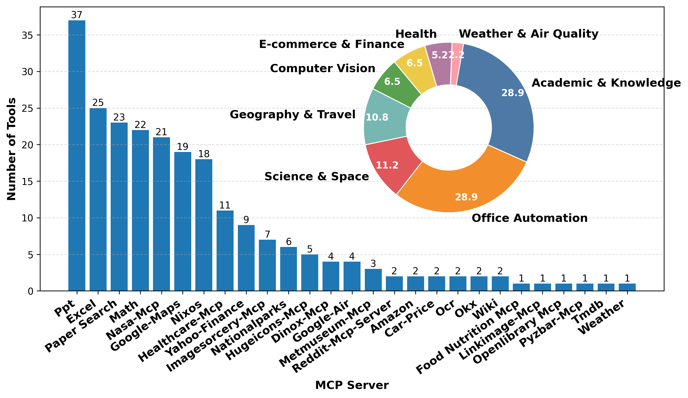
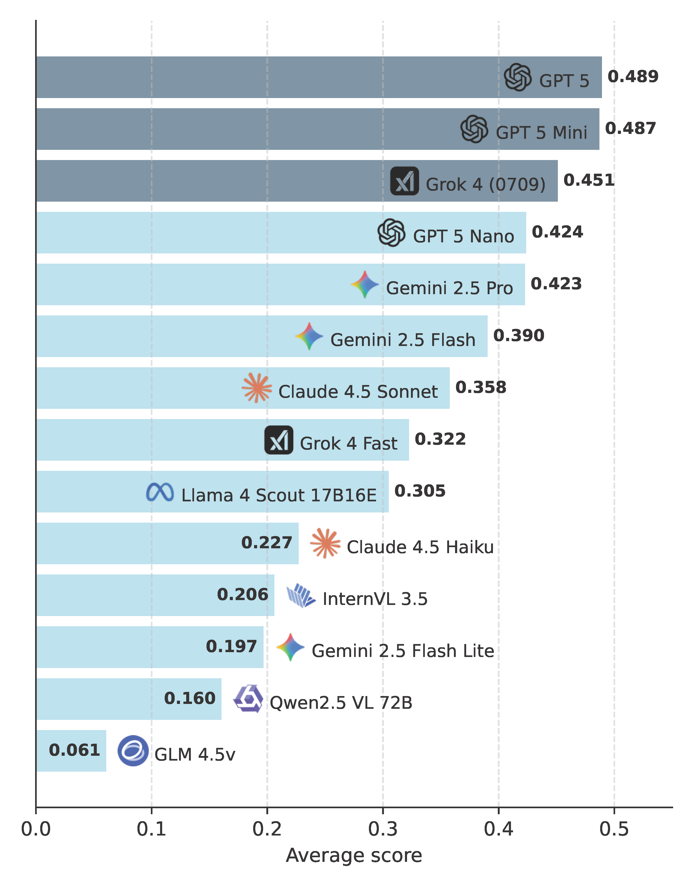

# M3‑Bench 
<p align="center">

</p>

A lightweight benchmarking and analysis suite around the Model Context Protocol (MCP). It orchestrates multiple MCP servers, drives different LLMs to complete tasks, produces reproducible results, and offers step-wise evaluations and visualizations. 🎯

- Key features ✨:
  - Unified multi‑provider LLM driver (see `models/api_clients.py`)
  - MCP server orchestration and tool selection (`mcp_host.py` + `mcp_servers.json`)
  - End‑to‑end benchmark scripts with reproducible outputs (`scripts/*.sh` → `results/`, `save/`)
  - Three evaluation layers: step‑level, call‑level, and final task completion, with plots

---

## Environment & Installation 🛠️

- Python 3.11 (recommended)
- Conda/mamba for env management
- Optional: CUDA, local/hosted LLMs, and API keys (OpenAI, Anthropic, Google/Gemini, xAI, DeepSeek, Zhipu, etc.)

```bash
# Create environment (example)
conda create -n mcp_app python=3.11 -y
conda activate mcp_app

# Install deps (adjust per repo files)
pip install -r requirements_pip.txt
conda install -r requirements_conda.txt  # if provided
```

---

## Configuration ⚙️

- MCP servers: edit `mcp_servers.json` at repo root (enable/disable servers, args, env vars).
- Model/API keys: create a `.env` at repo root and fill keys such as:
  - `OPENAI_API_KEY`, `ANTHROPIC_API_KEY`, `GOOGLE_API_KEY`, `XAI_API_KEY`, `DEEPSEEK_API_KEY`, `ZHIPU_API_KEY`, ...
- Quick setup for `.env`:
```bash
cp .env_example .env
```
- Data paths: default GT/PRED paths in scripts can be adjusted (see `scripts/evaluate_*.sh`). All scripts now use repo‑relative paths by default.

---

## Directory Overview 📁

- `scripts/`
  - `benchmark_fuzzy.sh`: run the benchmark to produce predictions (`results/<model>_test_mcp_fuzzy.json`).
  - `evaluate_step.sh`: step‑level evaluation and visualization (calls `evaluate_trajectories.py` and `tools/fig_step_eval_result.py`).
  - `evaluate_call.sh`: call‑level classification (outputs `callanalysis.json`, and composes a PDF via `tools/plot_call_pies.py`).
  - `evaluate_final_answer.sh`: final task completion evaluation (outputs `results/<model>/taskcompletion.json`).
- `models/`: unified drivers for OpenAI/Anthropic/Gemini/xAI/Deepseek/Zhipu/etc.
- `servers/`: sample MCP servers (weather, wiki, openlibrary, barcode, paper search, ...).
- `tools/`: utilities for result aggregation and plotting.
- `mcp_host.py`: manage multiple MCP sessions, discover tools, and route calls.
- `app_mm.py`: minimal FastAPI multimodal demo (image upload + MCP toolchain).
- `results/`, `save/`: outputs for evaluations and figures.

MCP tools across servers 🧰:



> Image assets download: To view all figures and example screenshots locally, download the `images/` folder from our Google Drive and place it at the repository root.
>
> Download link: [Google Drive folder](https://drive.google.com/drive/folders/1Szrfg-wix29leVqyudTXjz_GqhMyX8vQ?usp=drive_link)

## Quick Start 🚀

1) Run the benchmark (generate predictions) 🚀
```bash
bash scripts/benchmark_fuzzy.sh
# Output: results/<model>_test_mcp_fuzzy.json
```

2) Step‑level evaluation (process quality) 📈
```bash
bash scripts/evaluate_step.sh
# Output: results/<model>/ and figures (tools/fig_step_eval_result.py writes PDF to save/)
```

Example step‑level metrics across models:



3) Call‑level evaluation (MCP call classification) 📊
```bash
bash scripts/evaluate_call.sh
# Output: results/<model>/callanalysis.json and a combined pies PDF under save/
```

4) Final task completion evaluation ✅
```bash
bash scripts/evaluate_final_answer.sh
# Output: results/<model>/taskcompletion.json
```

> ℹ️ Note: Scripts read API keys from `.env` and allow changing model lists and data paths inside.

---

## Interactive Demo (optional) 💬

Multimodal chat with MCP tools and image uploads.

```bash
python app_mm.py --MODEL_PATH <your_model_or_api_name> \
  --max_step 4 --max_concurrent 4 --TOP_TOOLS 6 --max_new_tokens 20480
```

Then open the reported URL. Uploaded images are injected as data URLs for the model and MCP tools to consume.

---

## FAQ ❓

- Auth/key errors: ensure `.env` contains the right keys matching the selected driver.
- Missing outputs: check `results/` existence, correct `PRED_PATH/GT_PATH`, and that the model list includes your model.
- MCP tools unavailable: ensure the server is enabled in `mcp_servers.json` or run the server locally to debug.

---

## License 📄

Released under the MIT License. See `LICENSE` for details.

