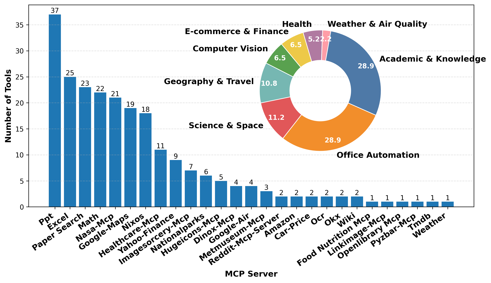
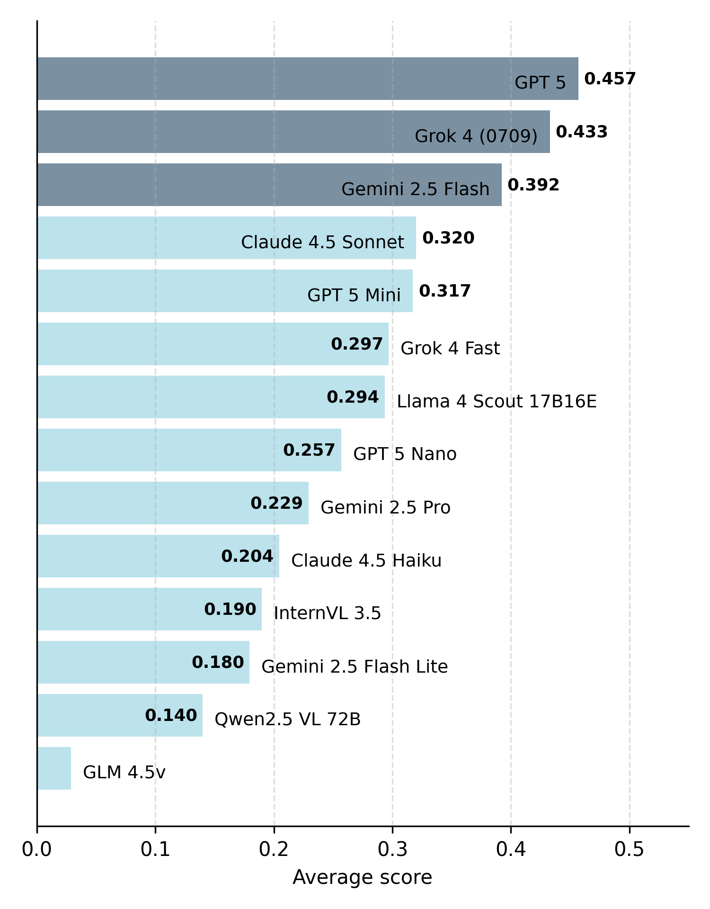

# 《M^3-Bench: Multi-Modal, Multi-Hop, Multi-Threaded Tool-Using MLLM Agent Benchmark》
<p align="center">

</p>

<p>
  <!-- <a href="https://github.com/EtaYang10th/Open-M3-Bench/graphs/contributors">
    
  </a> -->
  <a href="https://arxiv.org/abs/2511.17729">
    
  </a>
  <a href="https://etayang10th.github.io/m3-bench.github.io/">
    
  </a>
  <a href="https://github.com/EtaYang10th/Open-M3-Bench/blob/main/LICENSE">
    
  </a>
  <!-- <a href="https://github.com/EtaYang10th/Open-M3-Bench/issues">
    
  </a> -->
  <!-- <a href="https://github.com/EtaYang10th/Open-M3-Bench/network/members">
     -->
  </a>
  <a href="https://github.com/EtaYang10th/Open-M3-Bench/stargazers">
    
  </a>
<!-- </p> <p> -->
  <a href="https://huggingface.co/papers/2511.17729">
    
  </a>
  <a href="https://huggingface.co/datasets/EtaYang10th/Open-M3-Bench">
    
  </a>
</p>

Project blog: [m3-bench.github.io](https://etayang10th.github.io/m3-bench.github.io/)

A lightweight benchmarking and analysis suite around the Model Context Protocol (MCP). It orchestrates multiple MCP servers, drives different LLMs to complete tasks, produces reproducible results, and offers step-wise evaluations and visualizations. 🎯

- Key features ✨:
  - Unified multi‑provider LLM driver (see `models/api_clients.py`)
  - MCP server orchestration and tool selection (`mcp_host.py` + `mcp_servers.json`)
  - End‑to‑end benchmark scripts with reproducible outputs (`scripts/*.sh` → `results/`, `save/`)
  - Three evaluation layers: step‑level, call‑level, and final task completion, with plots

---

## Changelog 📝

- 2025-11-20: Initial public release of M3‑Bench.
- 2026-1-26: Added optional support for the total number of tools, and added three new CV-related test metrics.
- 2026-5-10: Replaced the paid **DINO-X-MCP** (cloud API, quota-limited) with a local **Ultralytics YOLO / YOLO-World** drop-in (`mcp-yolo`). Same tool names (`detect-all-objects`, `detect-objects-by-text`) and payload shape, no cloud key or quota. The old `dinox-mcp` entry in `mcp_servers.json` is kept but set to `"disabled": true`.
- 2026-7-23: Added a **local fallback layer** for unstable/dead external APIs (StableToolBench-style: real → record-replay cache → LLM simulator), **default OFF**. Added retry/backoff to arXiv and cache/retry to car-price (now defaults to the free no-auth parallelum FIPE mirror), and removed a hardcoded token from `servers/car-price-mcp-main/app.py`. See [Local Fallback / Mock Layer](#local-fallback--mock-layer-).
- 2026-7-25: Reliability and cost pass over the agent loop. Tool-produced images are now shown to the model, not just named; image media types come from magic bytes; per-round instructions use the `user` role. Added per-task timeout and bounded requeue to kill unbounded hangs. Cut LLM requests 61-80% and image payload ~85% by merging the prepare/work stages, dropping the end-stage call, and truncating tool results in history only. Optional per-task workspaces under `media/runs/` (`M3_WORKSPACE_MODE`). All switches in [Switches](#switches-environment-variables), each revertible.

---

## Environment & Installation 🛠️

- Python 3.11 (recommended)
- Conda/conda for env management
- Optional: CUDA, local/hosted LLMs, and API keys (OpenAI, Anthropic, Google/Gemini, xAI, DeepSeek, Zhipu, etc.)

```bash
# Create environment (example)
conda create -n mcp_app python=3.11 -y
conda activate mcp_app

# Install deps (adjust per repo files)
pip install -r requirements_pip.txt
conda install -r requirements_conda.txt  # if provided

#
(cd servers/tmdb-mcp-server && npm install && npm run build)
(cd servers/DINO-X-MCP && npm install && npm run build)
(cd servers/mcp-server-nationalparks && npm install && npm run build)
(cd servers/metmuseum-mcp && npm install && npm run build)
(cd servers/okx-mcp && npm install && npm run build)
(cd servers/hugeicons && npm install && npm run build)
(cd servers/math-mcp && npm install && npm run build)
(cd servers/healthcare-mcp-public && npm install)
(cd servers/nasa-mcp && pip install -e .)
```

---

## Configuration ⚙️

- MCP servers: edit `mcp_servers.json` at repo root (enable/disable servers, args, env vars).
- Model/API keys: create a `.env` at repo root and fill keys such as:
  - `OPENAI_API_KEY`, `ANTHROPIC_API_KEY`, `GOOGLE_API_KEY`, `XAI_API_KEY`, `DEEPSEEK_API_KEY`, `ZHIPU_API_KEY`, ...
- Quick setup for `.env`:
```bash
cp .env_example .env
```
- Data paths: default GT/PRED paths in scripts can be adjusted (see `scripts/evaluate_*.sh`). All scripts `cd` to the repo root and use repo‑relative paths, so no absolute path needs editing.
- Script environment knobs (all optional):
  - `M3_IMAGE_DIR` — task image root for `scripts/benchmark_fuzzy.sh` (default `media`).
  - `M3_CONDA_ENV` — conda env name to activate (default `mcp_app`).
  - `M3_SKIP_CONDA=1` — skip conda activation entirely (use the current interpreter).

---

## Directory Overview 📁

- `scripts/`
  - `benchmark_fuzzy.sh`: run the benchmark to produce predictions (`results/<model>_test_mcp_fuzzy.json`).
  - `evaluate_step.sh`: step‑level evaluation and visualization (calls `evaluate_trajectories.py` and `tools/fig_step_eval_result.py`).
  - `evaluate_call.sh`: call‑level classification (outputs `callanalysis.json`, and composes `save/call_pies.pdf` via `tools/plot_call_pies.py`).
  - `evaluate_final_answer.sh`: final task completion evaluation (outputs `results/<model>/taskcompletion.json`).
- `models/`: unified drivers for OpenAI/Anthropic/Gemini/xAI/Deepseek/Zhipu/etc.
- `servers/`: sample MCP servers (weather, wiki, openlibrary, barcode, paper search, ...).
- `tools/`: utilities for result aggregation and plotting.
- `app_mm.py`: minimal FastAPI multimodal demo (image upload + MCP toolchain).
- `results/`, `save/`: outputs for evaluations and figures.

## MCP Serves
MCP tools across servers 🧰:



<sub>Regenerate with `python tools/fig_tools_distribution.py --out_png images/mcp_tools_per_server.png`.</sub>

Test MCP Serves by 
```bash
python tools/test_mcp_servers.py
```

<!-- > Image assets download: To view all figures and example screenshots locally, download the `images/` folder from our Google Drive and place it at the repository root.
>
> Download link: [Google Drive folder](https://drive.google.com/drive/folders/1Szrfg-wix29leVqyudTXjz_GqhMyX8vQ?usp=drive_link) -->

## Quick Start 🚀

> **Get the data first.** `json/` (task annotations and ground truth) and
> `media/` (task images) are not committed — download them from
> [the Hugging Face dataset](https://huggingface.co/datasets/EtaYang10th/Open-M3-Bench)
> and unpack them into the repo root. Without them the steps below have nothing
> to read and will skip their work.

1) Run the benchmark (generate predictions) 🚀
```bash
bash scripts/benchmark_fuzzy.sh
# Output: results/<model>_test_mcp_fuzzy.json
```

2) Step‑level evaluation (process quality) 📈
```bash
bash scripts/evaluate_step.sh
# Output: results/<model>/ and figures (tools/fig_step_eval_result.py writes PDF to save/)
```

Example step‑level metrics across models:



<sub>Regenerate with `python tools/fig_step_eval_result.py` (writes both `save/*.pdf` and `images/*.png`).</sub>

3) Call‑level evaluation (MCP call classification) 📊
```bash
bash scripts/evaluate_call.sh
# Output: results/<model>/callanalysis.json and save/call_pies.pdf (one donut per model)
```

4) Final task completion evaluation ✅
```bash
bash scripts/evaluate_final_answer.sh
# Output: results/<model>/taskcompletion.json
```

> ℹ️ Note: Scripts read API keys from `.env` and allow changing model lists and data paths inside.

---

## Interactive Demo (optional) 💬

Multimodal chat with MCP tools and image uploads.

```bash
python app_mm.py --MODEL_PATH <your_model_or_api_name> \
  --max_step 4 --max_concurrent 4 --TOP_TOOLS 6 --max_new_tokens 20480
```

Then open the reported URL. Uploaded images are injected as data URLs for the model and MCP tools to consume.

---

## Local Fallback / Mock Layer 🛟

External APIs behind some MCP servers can go down, rate-limit (429), or lose
auth (401/403). Because evaluation is GT-bound on **tool name + arguments**
(the tool *return* never enters trajectory scoring), we can keep tasks running
offline without touching any GT file. The fallback is **OFF by default** and has
zero effect on existing runs unless you explicitly enable it.

Strategy (inspired by StableToolBench: cache-first + simulated API):

1. **Real first** — a successful real call is always used as-is.
2. **Record-replay cache** — if the real call fails, replay a previously
   recorded/generated return for the same normalized arguments (deterministic).
3. **LLM simulator** — on a cache miss, an LLM generates a realistic,
   schema-valid return (related keywords → plausible near-matches; unrelated →
   unrelated-but-valid), then caches it so future calls replay deterministically.
4. **Generic template** — if the LLM endpoint is unavailable, a safe synthetic
   payload is returned (never crashes, never blocks a task).

Only tools with a curated fixture or on the explicit allow-list are ever mocked;
visual/OCR/file tools (`ocr`, `mcp-yolo`, `imagesorcery-mcp`, `pyzbar-mcp`,
`ppt`, `excel`) are **never** simulated.

### Switches (environment variables)

| Env var | Default | Meaning |
| --- | --- | --- |
| `M3_MOCK_FALLBACK` | `0` (off) | Master switch. `1` enables fallback on real failure. |
| `M3_MOCK_LLM` | `1` | LLM simulator tier. Set `0` for cache/fixture-only (fully offline/deterministic). |
| `M3_MOCK_LLM_MODEL` | `claude-opus-4.5` | Model used by the simulator (via the apicursor endpoint). |
| `M3_MOCK_MARK_INLINE` | `0` | If `1`, wrap payloads as `{"mocked":true,"tier":...,"result":...}` so mocks are visible inline. |

Beyond the mock layer, the agent loop reads the switches below. Defaults are the
recommended settings; each one can be set to `0` to restore the previous
behaviour, which is useful when bisecting an unexpected result.

**Reliability / timeouts**

| Env var | Default | Meaning |
| --- | --- | --- |
| `M3_TASK_TIMEOUT` | `1800` | Wall-clock budget per task, in seconds. `0` disables. Worst case per task is `budget x 2 attempts x (requeue+1)`, so size the outer timeout accordingly. |
| `M3_MAX_TASK_REQUEUE` | `2` | How many times a failing task may be requeued before its error is recorded. Unbounded requeue previously kept the run alive forever. |
| `M3_TOOL_CALL_TIMEOUT` | `60` | Per-MCP-tool-call timeout, in seconds. |
| `M3_LLM_TIMEOUT` | `300` | Per-LLM-request timeout, in seconds. |
| `M3_LLM_MAX_RETRIES` | `1` | Cap on the provider SDK's own retries; the default of 2 silently multiplied the effective wall clock by three. |
| `M3_EXECUTOR_WORKERS` | auto | Thread-pool size for blocking LLM calls. `0` keeps the interpreter default. |

**Cost / context**

| Env var | Default | Meaning |
| --- | --- | --- |
| `M3_MERGE_PREPARE_WORK` | on | Merge the prepare and work stages into a single native tool-calling request. Only applies to models with native tool support. |
| `M3_SKIP_END_STAGE` | on | Infer round termination from the work stage instead of spending an extra LLM call on a yes/no question. |
| `M3_TOOL_RESULT_MAX_CHARS` | `2000` | Truncation limit for tool results **in the model-facing history only**; `steps[].calls[].result` on disk always keeps the full text. `0` disables. |
| `M3_IMAGE_RECODE_OVER_KB` | `512` | Re-encode images above this size as JPEG for transport. Most benchmark PNGs are stored at 2-3 bytes/pixel, so this dominates the payload. `0` disables. |
| `M3_IMAGE_MAX_EDGE` | `1568` | Longest edge, in pixels, for images sent to the model. Files on disk are never modified. `0` disables. |
| `M3_INSTRUCTION_ROLE` | `user` | Role for the per-round instruction. `system` restores the old behaviour, in which requests never ended on a user turn. |

**Workspace / diagnostics**

| Env var | Default | Meaning |
| --- | --- | --- |
| `M3_WORKSPACE_MODE` | `dedup` | `dedup` reuses existing copies in `media/`; `isolated` gives each task its own directory under `media/runs/<run_id>/<task_id>/`; `legacy` restores the original copy-every-time behaviour. |
| `M3_RUN_ID` | timestamp | Names the run directory. Reusing an id reproduces the same paths. |
| `M3_KEEP_WORKSPACE` | on | Keep per-task workspaces after a run for inspection. |
| `M3_LLM_STATS` | `0` | Collect request/token/image counters. |
| `M3_LLM_STATS_FILE` | — | Where to write those counters. |
| `M3_LLM_STATS_FLUSH_EVERY` | `10` | Flush the stats file every N requests, so a run killed by a signal still leaves data behind. |

The LLM simulator reuses the repo's OpenAI-compatible **apicursor** endpoint
(`CURSOR_API_BASE_URL` / `CURSOR_API_KEY` in `.env`). Every served mock is
appended to `tools/mock_runtime/logs/_mock_calls.log` (with `mocked: true` and
the tier) for full auditability — so mocked results are always traceable and do
not silently pollute benchmark conclusions.

```bash
# Example: run offline-resilient (real first, fall back only on failure)
M3_MOCK_FALLBACK=1 bash scripts/benchmark_fuzzy.sh
```

### Recording real fixtures (while APIs still work)

`tools/record_fixtures.py` calls tools with their **real GT arguments** and
records successful returns into the record-replay cache for later replay:

```bash
# Preview planned calls (reads json/test_mcp_GT.json, never modifies it)
python tools/record_fixtures.py --list --servers car-price paper_search nasa-mcp

# Record (rate-limit friendly; --delay seconds between calls, --limit per server)
python tools/record_fixtures.py --servers car-price paper_search --delay 5 --limit 5
```

NASA needs a real `NASA_API_KEY` (the shared `DEMO_KEY` 429s); the recorder
skips `nasa-mcp` with a note until the key is set.

### Runtime artifact isolation & git hygiene

All runtime products are isolated under `tools/mock_runtime/` and split by kind:

```
tools/mock_runtime/
  fixtures/<server>/<tool>.json     # curated sample fixtures  (COMMITTED, documentation)
  cache/<server>/<tool>.jsonl       # record-replay cache      (git-ignored, runtime)
  cache/_fipe_http/*.json           # car-price HTTP cache     (git-ignored, runtime)
  logs/_mock_calls.log              # audit log of served mocks (git-ignored, runtime)
```

`.gitignore` ignores `tools/mock_runtime/cache/`, `tools/mock_runtime/logs/`,
and the large regenerable discovery outputs (`tools/verify_report.json`,
`tools/verify_run.log`, `tools/mcp_tools_dump.json`,
`tools/mcp_functional_report.json`). The core code
(`tools/mock_fallback.py`, `tools/llm_simulator.py`, `tools/record_fixtures.py`)
and the curated sample fixtures under `tools/mock_runtime/fixtures/` are
committed, so the repo stays clean and push-ready.

---

## FAQ ❓

- Auth/key errors: ensure `.env` contains the right keys matching the selected driver.
- Missing outputs: check `results/` existence, correct `PRED_PATH/GT_PATH`, and that the model list includes your model.
- MCP tools unavailable: ensure the server is enabled in `mcp_servers.json` or run the server locally to debug.


---

## Citation

If M³-Bench helps your research, please cite:

```bibtex
@misc{zhou2025m3bench,
  title         = {M$^3$-Bench: Multi-Modal, Multi-Hop, Multi-Threaded Tool-Using MLLM Agent Benchmark},
  author        = {Zhou, Yang and Zhao, Mingyu and Wang, Zhenting and Gu, Difei and Guo, Bangwei and Ye, Ruosong and Han, Ligong and Jin, Can and Metaxas, Dimitris N.},
  year          = {2025},
  eprint        = {2511.17729},
  archivePrefix = {arXiv},
  primaryClass  = {cs.AI},
  url           = {https://arxiv.org/abs/2511.17729}
}
```

---

## License 📄

Released under the MIT License. See `LICENSE` for details.

